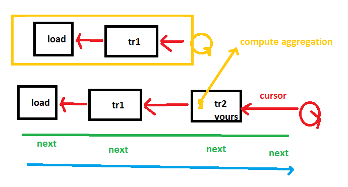

=================
Scikit.ML details
=================

.. contents::
    :local:

Elements of code
================

The following concepts are described in details
in section :ref:`l-mlnetdoc`.

Definitions
+++++++++++

* **active column**: a transform can replace a column by another or just skip one,
  in that case, the older column may remain but will be *hidden* as opposed to *active*.
* **row**: data unit for every data set, every row is usually independent
  from the others but not necessarily,
  not independant if there is a group column.
* **cursor**: row iterator on a dataset
* **getter**: each cursor does not give a pointer on a row (the type of row is
  unknown from `ML.net <https://github.com/dotnet/machinelearning>`_ 's point of view),
  but a cursor defines a way to access a specific column through a getter.
  A getter is a function which
  retrieve the value for a column for the current row.
* **schema**: a list of typed columns

IDataView
+++++++++

A data view must define a schema
and an access to them through the same API. By default, you should assume rows
of the data are not order and can be accessed through multiple threads at the same time.
`IDataView <https://docs.microsoft.com/en-us/dotnet/api/microsoft.ml.runtime.data.idataview?view=ml-dotnet>`_ API.

Other interfaces
++++++++++++++++

* `ICursor <https://github.com/dotnet/machinelearning/blob/master/src/Microsoft.ML.Core/Data/ICursor.cs>`_,
  see `ICursor Notes <https://github.com/dotnet/machinelearning/blob/master/src/Microsoft.ML.Core/Data/ICursor.md>`_
* `IDataTransform <https://github.com/dotnet/machinelearning/blob/master/src/Microsoft.ML.Data/Data/IDataLoader.cs#L91>`_
* `IRow <https://github.com/dotnet/machinelearning/blob/master/src/Microsoft.ML.Core/Data/IDataView.cs#L154>`_

Subleties
=========

Trainable transform
+++++++++++++++++++

The training usually happens when an object is instantiated
in `ML.net <https://github.com/dotnet/machinelearning>`_ and the next
step in the pipeline requires this transform to be instantiated.
The transforms in this extension postpones the training step
until some cursors are created:
`GetRowCursor <https://github.com/xadupre/machinelearningext/blob/master/machinelearningext/FeaturesTransforms/ScalerTransform.cs#L206>`_.
Pipeline instanciation happens following the blue arrow (forward).
Computing the prediction requires to get cursor
from every step and it follows the red path (backward).
You can either train a transform on the blue path
(called from the constructor) or on the red path
(called by the cursor instanciation). As the scoring process
may create several cursors working in parallel, the training
must be protected against multithreading.

.. index:: VBuffer, VBufferEqSort, ReadOnlyMemory, DvText

DataFrame Getters
+++++++++++++++++

.. index:: VBufferEqSort, VBuffer, DvText, ReadOnlyMemory, DataFrame

DataFrames expects to have sortable elements which is not the case
of objects representing strings ``ReadOnlyMemory<char>`` or
sparse arrays ``VBuffer<TYPE>``. *Scikit.ML* implements a sortable
version for both of them.

* ``VBuffer<TYPE>`` is replaced by ``VBufferEqSort<TYPE>``,
* ``ReadOnlyMemory<char>`` is replaced by ``DvText``.

The biggest change comes when a user tries to get a *getter* available
through interface ``IDataView``. The signature is ``ValueMapper<TYPE> GetGetter<TYPE>(int col)``.
DataFrame implements to let the user choose which ever type 
he would like to get. So the following calls do not return a null pointer,
``GetGetter<VBuffer<TYPE>>(0)``,
``GetGetter<VBufferEqSort<TYPE>>(0)``,
``GetGetter<ReadOnlyMemory<char>>(0)``,
``GetGetter<DvText>(0)``
even though *DataFrame* always use ``VBufferEqSort<TYPE>`` and ``DvText``.
Method ``GetGetter<TYPE>(int col)`` implements the implicit conversion
requested by the user.
